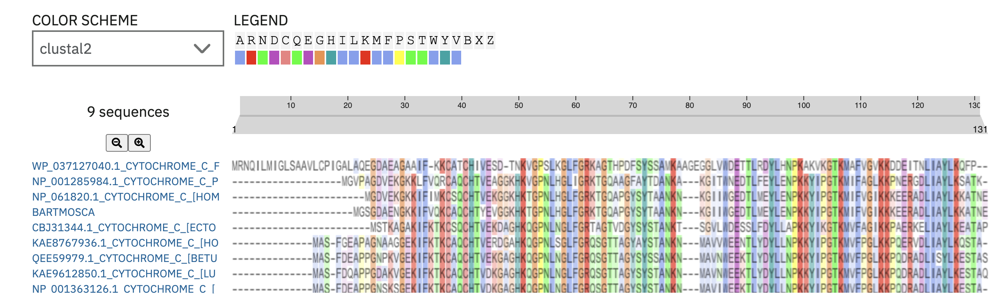

# Inferencias Evolutivas - Respuestas

## Desafío I

La táctica sería comparar la secuencia del Cyt del *bartmosca* con las secuencias de mosca y humano mediante alineamientos de secuencias. El alineamiento es el paso más crítico porque establece las correspondencias posicionales en la evolución, y a partir de él se puede cuantificar la divergencia entre las secuencias.

Como criterio de comparación, no alcanza con simplemente contar las sustituciones entre secuencias, ya que el número de sustituciones observadas puede subestimar los eventos evolutivos reales por el fenómeno de **homoplasia** (sustituciones convergentes o reversiones). Por eso es necesario aplicar modelos evolutivos (como Jukes-Cantor o Kimura 2P) que corrigen esa diferencia entre lo observado y lo esperado, obteniendo distancias evolutivas más precisas. Además, conviene considerar no solo identidad sino también similitud, usando matrices de sustitución como BLOSUM o PAM que ponderan los cambios según su probabilidad evolutiva.

Con esas distancias, se construye un árbol filogenético que permite visualizar con cuál organismo se agrupa más *bartmosca*. Para poder interpretar el árbol correctamente, es decir, darle sentido histórico y saber quién divergió de quién, ademas es necesario incluir una secuencia externa al grupo (de interes) que permita enraizar el árbol.

Si se usara el resto de las secuencias del análisis, el árbol permitiría ubicar a *bartmosca* en un contexto evolutivo más amplio. Dado que el Citocromo C es una proteína altamente conservada en eucariotas, pequeñas diferencias son evolutivamente informativas, y esperaríamos que *bartmosca* se agrupara más cerca de uno de los dos organismos, lo que indicaría qué porción de su secuencia predomina.

## Desafio II

