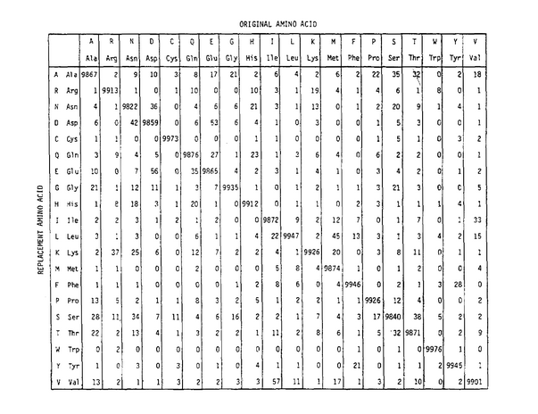
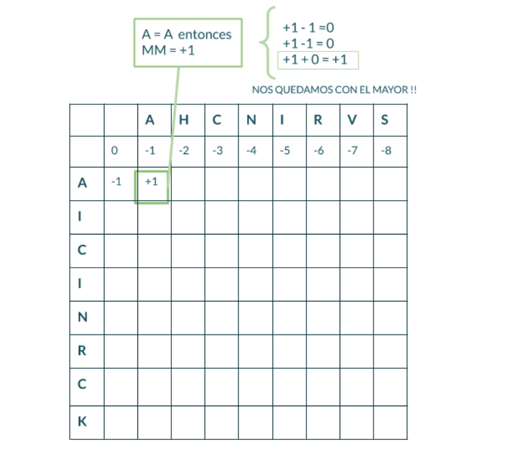

# Alineamientos y Búsqueda de similitud secuencial

> Autora: Dra. Ana Julia Velez Rueda
>
> **LICENSE**: This work is licensed under a
[Creative Commons Attribution-ShareAlike 4.0 International License][cc-by-sa].
>
>[![CC BY-SA 4.0][cc-by-sa-image]][cc-by-sa]

[cc-by-sa]: http://creativecommons.org/licenses/by-sa/4.0/
[cc-by-sa-image]: https://licensebuttons.net/l/by-sa/4.0/88x31.png
[cc-by-sa-shield]: https://img.shields.io/badge/License-CC%20BY--SA%204.0-lightgrey.svg

### Indice
  * [UNA PALABRA NO DICE NADA Y AL MISMO TIEMPO LO DICE TODO](#Intro)
  * [JUNTAS A LA PAR](#juntas_a_la_par)
  * [PARECIDO NO ES LO MISMO](#Intro_alineamientos)
  * [TIPOS DE ALINEAMIENTOS](#Alineamientos)
  * [BÚSQUEDA DE SIMILITUD SECUENCIAL](#Blast)

[UNA PALABRA NO DICE NADA Y AL MISMO TIEMPO LO DICE TODO](#Intro)

Desde los trabajos realizados por Kossel en 1898 (Kossel, 1898)​ en el que describe plantea que la función de las proteı́nas podrı́a estar relacionada con el tipo de aminoácidos que la componen y su disposición espacial, se empieza a intuir una posible relación entre la función proteica, su composición aminoacídica. Luego de décadas de experimentos, Anfinsen finalmente confirma que la secuencia aminoacídica contenía la información necesaria para el plegamiento de una proteína en una conformación biológicamente activa (Anfinsen et al., 1961)​. En dicho estudio, Anfinsen y colaboradores postularon que a partir de la estructura primaria de una proteína podría ser predicha la conformación o estructura terciaria biológicamente activa. También recientemente en la historia, más precisamente en 1953, Watson y Crick proponen un arreglo que estabiliza la estructura primaria del ADN y que, a posteriori, permitiría explicar los distintos mecanismos celulares involucrados en la expresión génica (Watson and Crick 1953). Hoy en día sabemos que tanto la estructura primaria proteica, como la de de ácidos nucleicos, aportan información relativa no solo a su estructura y función, si no que nos proveen información sobre las características un organismo dado y su relación evolutiva con otros organismos. 

Existen diferentes mecanismos que explican la biodiversidad, como las mutaciones, la duplicación de genes, reorganización de genomas e intercambios genéticos como recombinación, reordenamiento y transferencia lateral de genes. En las poblaciones ocurren variaciones aleatorias entre los organismos individuales, variaciones no ocasionadas por el ambiente, que en algunos casos pueden ser heredables. La interacción de las variaciones al azar y el ambiente determina el grado significativo en el que los organismos se reproducen y sobreviven (selección natural), y por tanto las características de la población. Dado suficiente tiempo, la selección natural lleva a la acumulación de cambios que diferencian los grupos de organismos. El análisis a nivel molecular de la evolución consiste en gran medida en determinar cómo las proteínas y el material genético se han transformado a través del tiempo.
 
[JUNTAS A LA PAR](#juntas_a_la_par)

Dos secuencias que comparten un ancestro común se denominan secuencias homólogas (Reeck et al., 1987). Aunque suele utilizarse muy frecuentemente de modo incorrecto, la homología es cualitativa. Las moléculas homólogas, u homólogos, se pueden dividir en dos clases: parálogos, que son homólogos que están presentes dentro de una especie y que suelen diferir en sus funciones bioquímicas detalladas; y ortólogos son homólogos que están presentes dentro de diferentes especies y tienen funciones muy similares o idénticas. Comprender la homología entre las moléculas puede revelar la historia evolutiva de las mismas, así como información sobre su función; Si una proteína recién secuenciada es homóloga a una proteína ya caracterizada, tenemos una fuerte indicación de la función bioquímica de la nueva proteína. La predicción de homologı́a se realiza extrayendo de las secuencias la información conservada durante la evolución, para lo que resulta necesario la comparación de las secuencias para identificar los residuos que tienen en común.

>
>**PARA PENSAR** 🤔: ¿Qué tipo de información se puede extraer de la comparación de secuencias? ¿Cómo esperás que se vea en una comparación? 🤔
>

Sin embargo, es importante tener en cuenta que con el tiempo dos genes pueden acumular una gran cantidad de cambios, de modo que puede que los datos de la secuencia en sí mismos no contengan suficiente información sobre la relación entre ellos. Por lo que el término homología se usa solo cuando el antepasado común es lo suficientemente reciente como para que la información de la secuencia haya retenido suficiente similitud como para hacer inferencias evolutivas (Park et al. 1998). Suele ser mejor para evaluar relaciones evolutivas lejanas la comparación a nivel de secuencias de proteínas, mientras que para relaciones más cercanas suelen utilizarse las secuencias de ácidos nucleicos que codifican para las mismas, ya que estas suelen ser menos informativas que las secuencias proteicas (Pearson, 1996). Es importante tener en cuenta que la conclusión de que dos (o más) genes o proteínas son homólogos es una conjetura o inferencia, que se derivan de múltiples cálculos, no es un hecho experimental. Pero como no existe un registro fósil de las formas extintas, se define la relación evolutiva entre dos genes sobre la base de la similitud entre ellos.

>
>**PARA PENSAR** 🤔: ¿Por qué crees que es mejor evaluar las relaciones evolutivas lejanas comparando proteínas? 🤔
>

[PARECIDO NO ES LO MISMO](#Intro_alineamientos)

Como se explicó anteriormente, la forma de encontrar relaciones evolutivas entre dos secuencias y evaluar el parecido entre ellas implica la comparación posición a posición entre ambas. Si bien, las secuencias proteicas y de ácidos nucleicos pueden ser pensadas como textos, o cadenas de caracteres, el proceso de alinear dos secuencia no es tan sencillo como poner una secuencia encima de otra y comparar columna a columna si existe concordancia entre los residuos (o caracteres). ¿Por qué? Pues porque como dijimos antes, a lo largo del tiempo las secuencias pueden mutaciones, inserciones y deleciones, y la consideración de estos cambios no es resulta trivial.
 
>🧗🏻‍♀️DESAFIO I: Intentemos, entonces alinear estas dos palabras, para comprender mejor el problema. Alineá en la [tabla interactiva](https://flbulgarelli.github.io/umi/#una-palabra-no-dice-nada-y-al-mismo-tiempo-lo-dice-todo) las palabras "BANANA" y "MANZANA".  
>
>¡Tomá nota de tus observaciones y de las conclusiones que se desprendan de estas observaciones!
>☑️ PREGUNTAS DISPARADORAS: ¿Existe una única forma de alinearlas? ¿Es alguno de los posibles alineamientos mejor que otro? Si así fuera ¿Por qué?
>

Ahora bien, como bien dijimos el objetivo de alinear secuencias es el de poder inferir relaciones evolutivas entre ellas y evaluar su parecido. Sin embargo, poder evaluar el parecido entre dos secuencias puede conllevar algunas dificultades. En primera instancia definamos un concepto que nos puede ser útil en este sentido, la identidad. Este se define como la suma de residuos idénticos en posiciones equivalentes en dos secuencias alineadas.
 
>🧗🏻‍♀️DESAFIO II: En la siguiente [tabla interactiva](https://flbulgarelli.github.io/umi/#una-palabra-no-dice-nada-y-al-mismo-tiempo-lo-dice-todo)  distintos alineamientos para las palabras "ANA" y "ANANA". Verás que en el margen superior izquierdo aparece un valor de identidad calculado para cada alineamiento que intentes.
>
>¡Tomá nota de los valores de identidad observados y de las conclusiones que se desprendan de estas observaciones!
> 
>☑️ PREGUNTAS DISPARADORAS: ¿Son todos los valores iguales? ¿Qué consideraciones deberían tenerse en cuenta a la hora de realizar el cálculo? ¿Se te ocurre, distintas formas de calcularlo? ¿Serán todas ellas igualmente válidas en Biología?

Hemos definido la identidad y hemos comenzado a entender las implicancias de introducir esos guiones, que de ahora en más llamaremos "gaps". La presencia de gaps, que introducen huecos en el alineamiento, representan las inserciones y deleciones. Y cómo pueden intuir, la apertura de un gap en una u otra posición o la persistencia de más de un gap en el alineamiento, tiene sus implicancias.

>
>🧗🏻‍♀️DESAFIO III: Probá en  [tabla interactiva](https://flbulgarelli.github.io/umi/#una-palabra-no-dice-nada-y-al-mismo-tiempo-lo-dice-todo) distintos alineamientos para las palabras "ANA" y "ANANA". Verás que en el margen superior izquierdo aparece un valor de identidad calculado para cada alineamiento que intentes y un botón para cambiar la penalidad que se le otorga a dicho para el cálculo de identidad.
> 
>Probá varias combinaciones, tomá nota de los valores de identidad observados y de las conclusiones que se desprendan de estas observaciones.
>
>☑️ PREGUNTAS DISPARADORAS: ¿Cómo se relacionan los valores de identidad obtenidos con las penalizaciones que se imponen al gap? ¿Qué implicancias crees que tiene una mayor penalización de gaps? ¿Se te ocurre alguna otra forma de penalización que no haya sido tenido en cuenta en este ejemplo?
>

Ahora que pudimos pensar en forma general las implicancias de abrir gaps en un alineamiento, situémonos nuevamente en el contexto biológico. Cómo bien sabemos, en 1958 Crick plantea el dogma central de la genética, donde establece que el flujo de información va del ADN al ARN, y de éste a las proteínas. La expresión génica, con sus pasos de transcripción y traducción, permite obtener proteínas a partir de la información codificada en el ADN. Sabemos, además, que el código genético consiste en 64 combinaciones de tripletes (codones) de nucleótidos, que se corresponden con los distintos aminoácidos, y que guía la decodificación del "mensaje" o "información" que aportan los genes para la síntesis de proteínas.

>**PARA PENSAR** 🤔: Entonces, pensando en un alineamiento de ácidos nucleicos ¿Cuáles te parece que son las implicancias de abrir un gap en el alineamiento? ¿Qué implicaría la inserción o deleción de una región de más de un residuo?
>
>🧗🏻‍♀️DESAFIO IV: Probá en la [tabla interactiva](https://flbulgarelli.github.io/umi/#una-palabra-no-dice-nada-y-al-mismo-tiempo-lo-dice-todo) distintos alineamientos para las secuencias nucleotídicas. Podrás ver las traducciones para cada secuencia.
Probá varias combinaciones, tomá nota de las observaciones y de las conclusiones que se desprendan de estas.
>
>**PARA PENSAR** 🤔: ¿Dá lo mismo si el gap que introducís cae en la primera, segunda o tercer posición del codón? ¿Cómo ponderarías las observaciones de este ejercicio para evaluar el parecido entre dos secuencias?

Otra forma de estimar el parecido entre dos secuencias pondera estas implicancias en la presencia de inserciones y deleciones que estuvimos evaluando, además de puntuaciones que ponderen los cambios de un caracter por otro de forma diferencial. ¿Por qué? Porque si hablamos de nucleótidos o aminoácidos estarán de acuerdo que no es indistinto cambiar uno por otro. Una mutación en un aminoácido puede, por ejemplo, generar un cambio drástico en la polaridad de una región de la proteína o implicar un cambio a nivel de su estructura secundaria. Por lo tanto, podríamos estimar la similitud que existe entre dos secuencias, como la suma de puntuaciones correspondientes a residuos en posiciones equivalentes en dos secuencias alineadas. Las tablas de puntuaciones de sustitución de un residuo por otro se denominan matrices de sustitución, y se construyen teniendo en cuenta los cambios observados en secuencias conocidas.

Margaret Dayhoff desarrolló las matrices PAM para aminoácidos, que se basan en las secuencias de proteínas que había compilado durante una década, publicadas como el Atlas de secuencia y estructura de proteínas (Dayhoff, 1978). En las matrices PAM cada elemento de la matriz Mij cuantifica la probabilidad de que un aminoácido i sea reemplazado por otro aminoácido j en el intervalo evolutivo de 1 PAM (1 PAM se define como el intervalo evolutivo en que cambia un 1% de los aminoácidos en el alineamiento de 2 secuencias). Estas mutaciones se identificaron comparando secuencias muy similares con al menos un 85% de identidad, y se supone que cualquier sustitución observada fue el resultado de una única mutación entre la secuencia ancestral y una de las secuencias actuales. Las matrices de sustitución se utilizan como parámetros de los algoritmos de alineamientos de secuencias proteicas, de forma de poder asignarle una puntuación a cada posible alineamiento, y de este modo poder elegir el mejor. En el caso de los alineamientos de nucleótidos, suelen utilizarse un sistema de puntuación mucho más simple.

Figura extraída del trabajo: A Model of Evolutionary Change in Proteins. Dayhoff, M.O., R.M. Schwartz, and B.C. Orcutt. 1978. Atlas of Protein Sequence and Structure Vol. 5, suppl. 3. National Biomedical Research Foundation, Washington, D.C.

Ahora bien, aún cuando seamos capaces de encontrar el mejor puntaje para nuestro alineamiento ¿cómo sabemos si este alineamiento tiene relevancia biológica, es decir que estas dos secuencias son homólogas, o el alineamiento es fruto del azar? Se puede estimar para cada alineamiento una probabilidad o significación estadística que nos permita estimar la inexactitud de las medidas de similitud e identidad, comparando el resultado obtenido con el esperado si las secuencias fueran alineadas al azar.

👀 ¡Es importante tener en cuenta, que una significación estadı́stica no garantiza certeza!
 
[TIPOS DE ALINEAMIENTOS](#Alineamientos)

Existen distintas herramientas para alinear secuencias, que podríamos clasificar en dos tipos:
- Global: alineamiento de la secuencia completa. Es útil cuando se comparan secuencias muy similares en tamaño y composición, por ejemplo de dos genes muy conservados.
 
- Local: cuando sólo nos interesa alinear regiones similares entre secuencias. Se utiliza cuando las secuencias a comparar son diferentes en tamaño o poseen regiones no conservadas
 
Un de los más importantes algoritmos para encontrar alineamientos globales es el de Needleman-Wunsch. Este es un ejemplo de algoritmo de programación dinámica, que subdivide los problemas de cálculo, asegurando encontrar la solución óptima para 2 secuencias dadas. Este utiliza una matriz cuadrada para asignar puntuación para los distintos alineamientos posibles, dada una puntuación para matches, mismatches y gaps; y luego retrocediendo a lo largo de la mejor alineación posible (de mayor puntuación).

>🧗🏻‍♀️DESAFIO V: Estuvimos viendo que el alineamiento de secuencias no es trivial y requiere contemplar los múltiples caminos posibles, teniendo en cuenta al mismo tiempo la información biológica que restringe ese universo de posibilidades. 
>

¡Es momento de llevar entonces estos conceptos a lo concreto! 
 
Te proponemos pensar los pasos a seguir en un alineamiento de dos secuencias cortas, teniendo en cuenta una matriz genérica de scoring (puntuación) que contemple las complejidades que estuvimos viendo, es decir que penalice de distinto modo una inserción o deleción, que una discordancia (mismatch) o una coincidencia (match). Escribilos o esquematizalos en un diagrama de flujo.
 
> **PARA PENSAR** 🤔: ¿En qué consiste la programación dinámica? ¿Por qué crees que es útil en este caso? 

Veamos un poco más al detalle cómo funciona el algoritmo de **Needleman-Wunsch**. Como bien dijimos anteriormente, este es un  procedimiento que consiste en buscar series de caracteres individuales que se encuentran en el mismo orden en las secuencias a comparar, colocándolas de modo de maximizar su similitud. Este funciona en base a un sistema de puntuaciones de cuán parecidas son dos secuencias. Este algoritmo calcula secuencialmente para cada posición de la matriz un puntaje que deriva de buscar el mayor score entre los posibles scores calculados como la suma de una celda adyacente, más el match/mismatch (MM) de la celda actual, valor que se obtiene utilizando las matrices de sustitución que introdujimos anteriormente. Se derivan, entonces, los siguientes valores:
 
* MM + Score de la celda superior
* MM + Score de la  celda izquierda
* MM + Score de la  celda superior izquierda

Entre estos tres valores, el score de nuestra celda en cuestión será el mayor. Por último, el algoritmo propone el mejor alineamiento posible, que devuelva el mayor puntaje global. Este alineamiento propuesto se construye, siguiendo el camino de mayor score, recorriendo  la matriz en sentido opuesto; alineando los dos caracteres cuando nos movemos en diagonal se alinean los dos caracteres, introduciendo un gap en la secuencia horizontal cuando nos movemos hacia abajo y un gap en la secuencia vertical cuando nos movemos hacia la derecha.

>🧗🏻‍♀️DESAFIO VI: Utilizando la herramienta interactiva  desarrolladas por el Grupo de Bioinformática de Freiburg probá distintos Gap penalties para el ejemplo propuesto y observá lo que ocurre.
>
>Interpretando la recursión, explicá con tus palabras de dónde salen los valores de la matriz  que se construye. ¡Esquematiza tus conclusiones!
>

Asimismo existen herramientas que permiten tanto comparaciones de secuencias de a pares y o realizar alineamientos múltiples:
 
- A pares de secuencias: mide la similitud entre dos secuencias.
- Alineamiento múltiple: compara más de dos secuencias al mismo tiempo.
 
En ambos casos el alineamiento puede ser local o global, lo que supondrá algunas limitaciones de uso para cada caso.
 
>**PARA PENSAR** 🤔: ¿En qué casos serán de utilidad uno u otro tipo de alineamientos? ¿Qué limitaciones tendrá cada uno?

[BÚSQUEDA DE SIMILITUD SECUENCIAL](#Blast)

BLAST (Basic Local Alignment Search Tool) (S. Henikoff and J. G. Henikoff, 1992) es la herramienta más utilizada en ciencia para realizar búsquedas por similitud secuencial.  Esta basa su funcionamiento en la construcción de alineamientos locales. Este algoritmo heurı́stico compara una secuencia problema contra secuencias de distintas bases de datos, buscando alinear subsecuencias (k-meros) de longitud más corta (3 amino ácidos o 28 nucleótidos por defecto) con las secuencias de la base de datos. Asumiendo que una secuencia similar contendrá alguna de estas palabras o k-meros, extiende el alineamiento hacia ambos lados mediante el algoritmo de programación dinámica de Smith–Waterman (D. States, W. Gish, and S. Altschul, 1991). Existe una gran familia de programas derivados de este algoritmo. 

>**PARA PENSAR** 🤔: Ingresá al servidor del NCBI y mirá los distintos programas derivados del BLAST que se ofrecen ¿Para qué sirve cada uno? ¿En qué casos usarías cada uno?   
Vamos a explorar esta herramienta!
>
>🧗🏻‍♀️DESAFIO VII: calculá el E-value y % identidad utilizando el programa Blast de la siguiente secuencia input usando 20000 hits, un e-value de 100 y tomando aquellos hits con un mínimo de 70% cobertura. Observe y discuta el comportamiento de : E-value vs. % id, Score vs % id,  Score vs E-value
>
>VVGGLGGYMLGSAMSRPIIHFGSDYEDRYYRENMHRYPNQVYYRPMDEYSNQNNFVHDCVNITIKQHTVTTTTKGENFTETDVKMMERVVEQMCITQYERESQAYYQRGSSMVLFSSPPVILLISFLIFLIVG
>
>Veamos ahora qué pasa cuando usamos sólo fragmentos de nuestra secuencia problema: 
>
>🧗🏻‍♀️DESAFIO VIII: Realizá nuevas búsquedas usando la mitad de la secuencia problema y para un cuarto de la secuencia original. Compará los gráficos obtenidos. ¿Qué conclusiones puede sacas?
>

A partir de los resultados de una búsqueda con BLAST se pueden inferir relaciones funcionales o estructurales entre secuencias homólogas. Ya que esta búsqueda asume una relación evolutiva, es posible de este modo identificar nuevos miembros de una familia de genes o de proteínas o encontrar secuencias idénticas, con una significancia estadística. 

>🧗🏻‍♀️DESAFIO IX: Utilizando BLAST utilice búsquedas de similitud secuencial para identificar a la siguiente proteína:
>
>MIDKSAFVHPTAIVEEGASIGANAHIGPFCIVGPHVEIGEGTVLKSHVVVNGHTKIGRDNEIYQFASIGEVNQDLKYAGEPTRVEIGDRNRIRESVTIHRGTVQGGGLTKVGSDNLLMINAHIAHDCTVGNRCILANNATLAGHVSVDDFAIIGGMTAVHQFCIIGAHVMVGGCSGVAQDVPPYVIAQGNHATPFGVNIEGLKRRGFSREAITAIRNAYKLIYRSGKTLDEVKPEIAELAETYPEVKAFTDFFARSTRGLIR
>
>**PARA PENSAR** 🤔: ¿Cuál es la función de la proteína? ¿A qué grupo taxonómico pertenece? A un nivel de significancia estadística adecuado ¿cuántas secuencias similares se encuentran? 
>
>🧗🏻‍♀️DESAFIO X:  Realizá una nueva corrida del BLASTp, utilizando la misma secuencia , pero ahora contra la base de datos PDB.  ¿Se obtienen los mismos resultados? ¿Qué tipo de resultados(hits) se recuperan? ¿Cuándo nos podría ser útil este modo de corrida?
