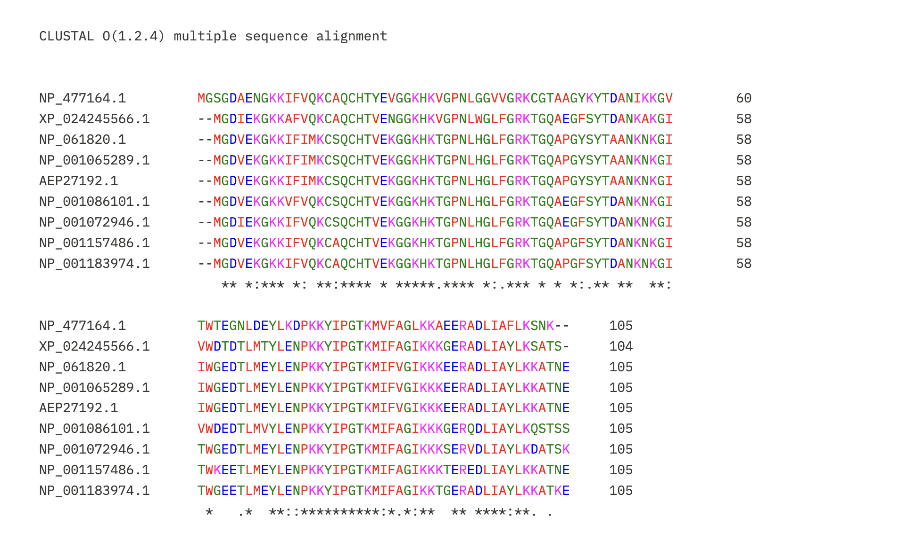
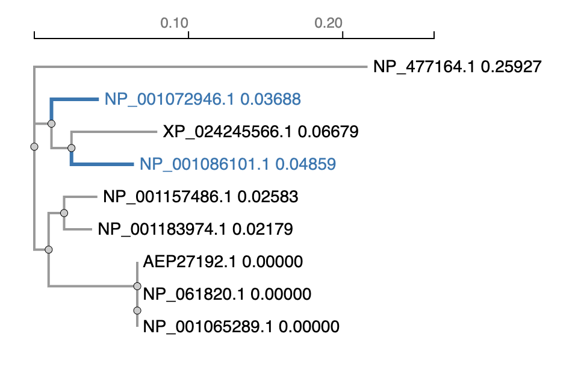

| Secuencia	|Nombre taxonómico | Nombre común | 
|-------------	|----------	|--------------	|
| NP_061820.1 | Homo sapiens | Humano | 
| NP_001072946.1 | Gallus gallus | Gallina |
| NP_001065289.1 | Pan troglodytes | Chimpancé |
| NP_001157486.1 | Equus caballus | Caballo |
| NP_001183974.1 | Canis lupus familiaris | Perro doméstico |
| AEP27192.1 | Gorilla gorilla | Gorila |
| XP_024245566.1 | Oncorhynchus tshawytscha | Salmón Chinook |
| NP_001086101.1 | Xenopus laevis | Rana africana de uñas |
| NP_477164.1 | Drosophila melanogaster | Mosca de la fruta |

>**PARA PENSAR** 🤔:¿Cuán sencillo será alinear dos o más secuencias a mano? ¿Cuánto influirán el número de secuencias a alinear, su longitud, y la similitud entre ellas?
>
Es muy difícil incluso con dos secuencias. Hay que probar manualmente dónde insertar gaps para maximizar las coincidencias, y el número de combinaciones posibles crece exponencialmente con la longitud. Con más secuencias simultáneas se vuelve prácticamente imposible

>**PARA PENSAR** 🤔:¿Son parecidos los citocromos c de humano y gallo? 
>
Sí, bastante. Coinciden en la mayoría de las posiciones, con diferencias puntuales en algunos aminoácidos. Esto refleja que comparten un ancestro común, aunque más lejano que entre los primates.

>**PARA PENSAR** 🤔:¿Qué teorías subyacen a este análisis?
>
La teoría central es la evolución por descendencia común: todos los organismos comparten un ancestro común, y cuanto más reciente ese ancestro, más similares son sus secuencias.

>**PARA PENSAR** 🤔:¿Cómo nos ayuda la evolución a explicar sus similitudes y diferencias?
>
Las diferencias entre secuencias son mutaciones acumuladas desde que los linajes se separaron: cuantas más diferencias, más tiempo llevan separados. 

Preguntas post alineacion:

PARA PENSAR 🤔:¿Qué indican los colores?

Los colores agrupan aminoácidos según sus propiedades bioquímicas.

| Color | Propiedad | Aminoácidos |
|-------|-----------|-------------|
| Azul | Hidrofóbicos | A, C, I, L, M, F, W, V |
| Rojo | Carga positiva | K, R |
| Magenta | Carga negativa | D, E |
| Verde | Polares | N, Q, S, T |
| Cian | Aromáticos | H, Y |
| Rosa | Cisteínas | C |
| Naranja | Glicinas | G |
| Amarillo | Prolinas | P |

Fuente: Jalview Documentation — Clustal Colour Scheme. https://www.jalview.org/help/html/colourSchemes/clustal.html

PARA PENSAR 🤔:¿Qué indican el guión (-), los dos puntos (:) y el asterisco (*)?

- `*` (asterisco): posición con un único residuo completamente conservado en todas las secuencias.
- `:` (dos puntos): conservación entre grupos de propiedades fuertemente similares.
- `.` (punto): conservación entre grupos de propiedades débilmente similares.
- ` ` (espacio en blanco): posición no conservada.
- `-` (guión): gap, representa una inserción o deleción en esa región. No significa que la secuencia sea más corta en general, sino que en esa posición una secuencia tiene un aminoácido que la otra no tiene, y se inserta el guión para mantener el alineamiento.

Fuente: Wikipedia — Clustal. https://en.wikipedia.org/wiki/Clustal

PARA PENSAR 🤔: A simple vista, ¿se conserva la secuencia del citocromo c en los organismos?

Sí, en gran medida. El citocromo c es una de las proteínas más conservadas evolutivamente. Hay muchas posiciones que muestran `*` entre organismos tan distintos como humanos y moscas. Las diferencias existen pero son en su mayoría sustituciones conservativas (`:`), lo que indica que la función se mantiene aunque la secuencia exacta varíe un poco.

PARA PENSAR 🤔: ¿Creeríamos que todos los organismos se asemejan por igual al resto, o se pueden identificar grupos de mayor similitud? Si es así, ¿tienen sentido?

No por igual. Se pueden identificar grupos: humano + chimpancé + gorila muy similares entre sí, luego caballo y perro algo más alejados, luego gallina, luego rana, y la mosca más distante de todos. Tiene sentido porque los humanos, chimpance y gorila tienen como ancestro en comun el primate. 

PARA PENSAR 🤔: ¿Qué evidencias nos aportaría este análisis, a la luz de la evolución?

El análisis muestra que especies con ancestro común más reciente tienen secuencias más similares, lo que es consistente con la evolución por descendencia con modificación. La conservación de la proteína entre organismos tan distintos sugiere que el citocromo c cumple una función esencial que no tolera grandes cambios.

>A juzgar por los organismos participantes, ¿cuáles creería que deberían estar más agrupados en el árbol filogenético?
>
- Humano, Chimpance, Gorila.
- Perro, Caballo
- Salmon, Rana, Gallina
- Mosca

>Observemos el árbol filogenético. ¿Concuerda con lo esperado? ¿De qué organismos son los citocromos c más parecidos? ¿Cómo se explica?
>
Coincide con lo esperado. Los citocromos c más parecidos son los de humano, chimpancé y gorila (distancia 0.000, es decir idénticos). Se explica porque cuanto más cercano es el ancestro común entre dos especies, menos tiempo hubo para acumular mutaciones en la proteína.
